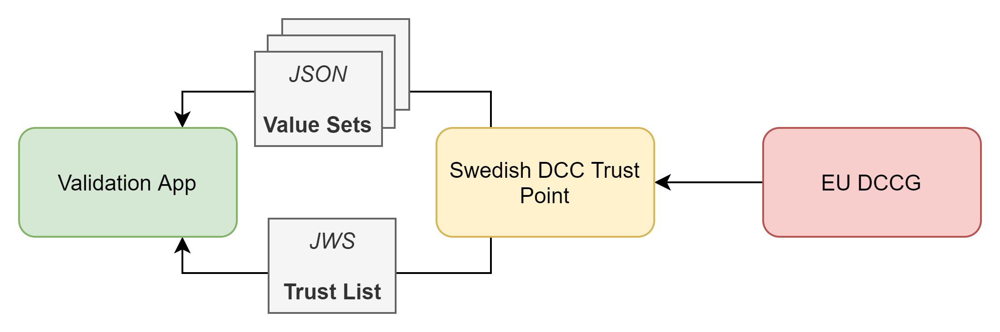
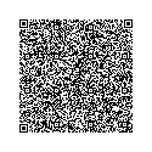
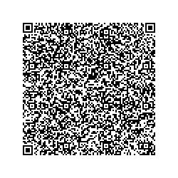
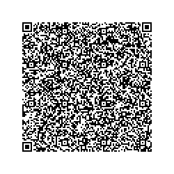
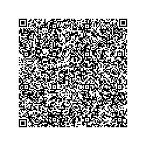
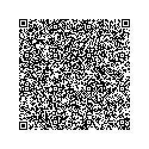

# DCCValidator

Xamarin App for validating EU Digital Covid Certificate

---

## About DCC Validator

This GitHub-repository contains a reference implementation for the validation of the EU Digital Covid Certificate

The solution is developed by Swedish Agency for Digital Government (DIGG).

## Components

* [DGCValidator] - The Common Xamarin code.

* [DGCValidator.Android] - Android specific code.

* [DGCValidator.iOS] - iOS Specific code.

## External resources

DCC validator downloads, and caches external resources that are used during the verification process.
The application downloads its resources once every 24 hours, when internet connectivity is available.
In the event that no internet connectivity is available or that the resources can't be downloaded, then
the cached version of the resources are used until they can be downloaded and cached once again.

The application uses the Swedish DCC Trust Point to download its external resources 
* QA-environment https://dccg-qa.covidbevis.se/tp/
* Production-environment https://dccg.covidbevis.se/tp/

There are two resources that the application needs to perform the verification:
* __Trust List__ - A list of all valid Signature public keys
* __Value Sets__ - Multiple value sets each with a defined set of values. E.g. _vaccines-covid-19-names_ 

The resources available at the Swedish DCC Trust Point have their origin in the EU Digital Covid Certificate Gateway (EU DCCG),
as shown in the following illustration:

More information about the Swedish DCC Trust Point can be found at [DCC-trust](https://github.com/DIGGSweden/dgc-trust)

## Test Certificates

The following certificates can be used in the QA-environment.

### Vaccination certificates

#### Valid Signature (_Signture public key present at [DGCG-QA](https://dccg-qa.covidbevis.se/tp/)_)

__Valid through 2023-07-01, Vaccine Comirnaty, Dose 1/2__

__Valid through 2023-07-01, Vaccine Comirnaty, Dose 2/2__

__Valid through 2023-07-01, Vaccine Comirnaty, Dose 3/2__

__Valid through 2023-07-01, Vaccine Comirnaty, Dose 3/3__

__Valid through 2023-07-01, Vaccine BBIBP-CorV, Dose 2/2__

__Expired, Vaccine Comirnaty, Dose 2/2__

#### Invalid Signature (_Signture public key __not__ present at [DGCG-QA](https://dccg-qa.covidbevis.se/tp/)_)

__Invalid signer & expired__

------

Copyright &copy; 2021, [Myndigheten för digital förvaltning (DIGG)](http://www.digg.se). Licensed under the MIT license.
